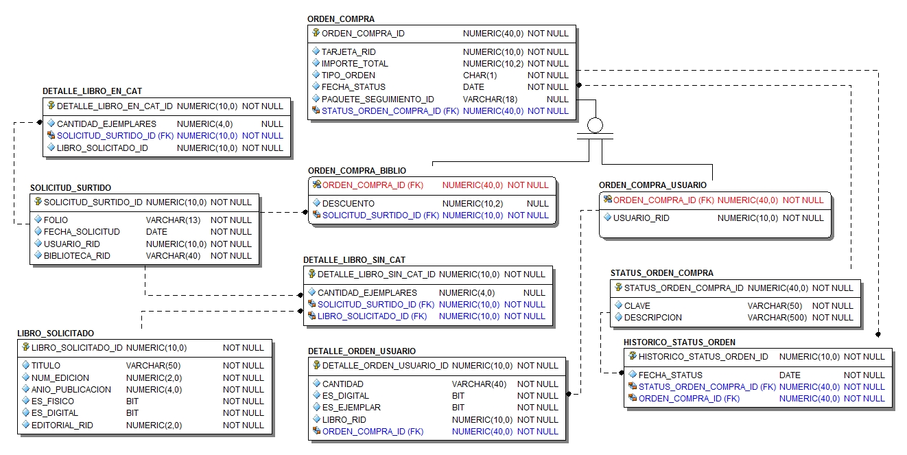

# SchoolBook
## schoolbook-ordenes.
* Este servicio se encarga de realizar la administración de las ordenes de compra que pueden provenir de 2 fuentes:
	* De solicitudes capturadas por las bibliotecas
	* De los clientes que realizan compras por Internet
* Adicional a los datos de las ordenes de compra,  se administra su histórico de status que permite llevar el control de su ciclo de vida.
* El control y registro de las solicitudes de surtido de libros por parte de bibliotecas tanto para libros existentes en el acervo de SchoolBook como para libros nuevos también es implementado en este servicio.
* La definición del caso de estudio completo se puede revisar en este [enlace](https://github.com/school-book/schoolbook-app)
### Entidades principales
* Solicitud de Surtido
* Orden de compra
* Orden de compra  realizada por una biblioteca
* Orden de compra realizada por un cliente
* Libros solicitados que no existen en el catálogo actual.
### Modelo relacional

* Se hace uso de una Jerarquía para identificar los 2 tipos de órdenes de compra que administra este servicio.
* Para cada orden de compra se guarda su detalle en el que se incluye la cantidad de ejemplares (para el caso de los libros físicos).
* Observar la existencia de la entidad LIBRO_SOLICITADO. En esta entidad se almacenan los datos de los libros que no existen en el catálogo actual de SchoolBook.  Todos estos libros representan adquisiciones nuevas.
